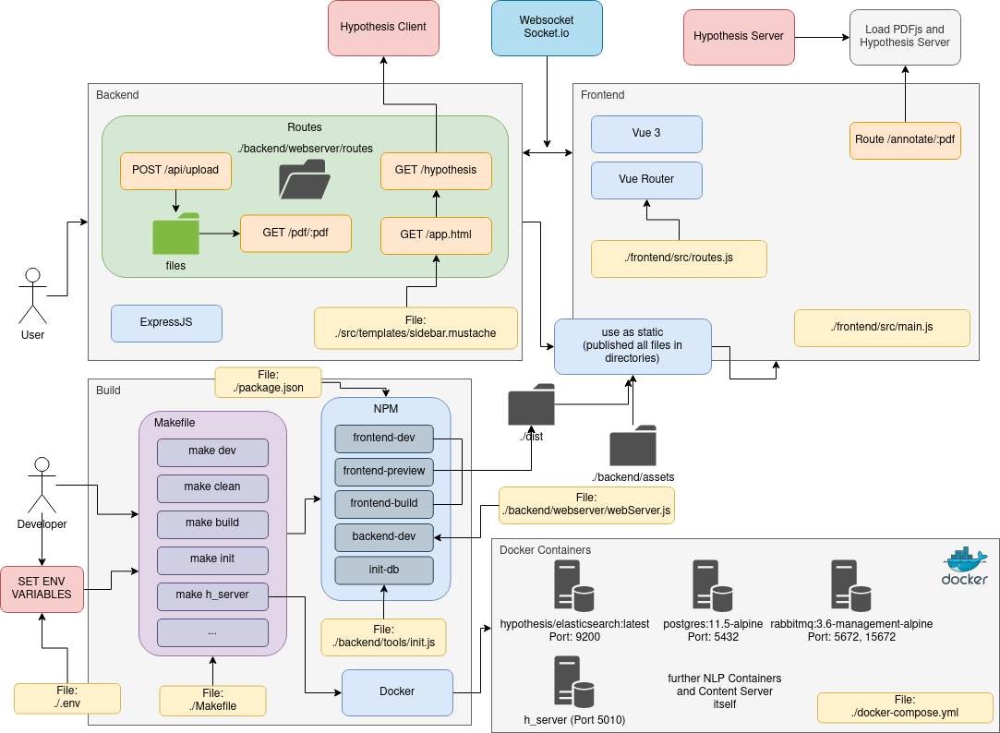
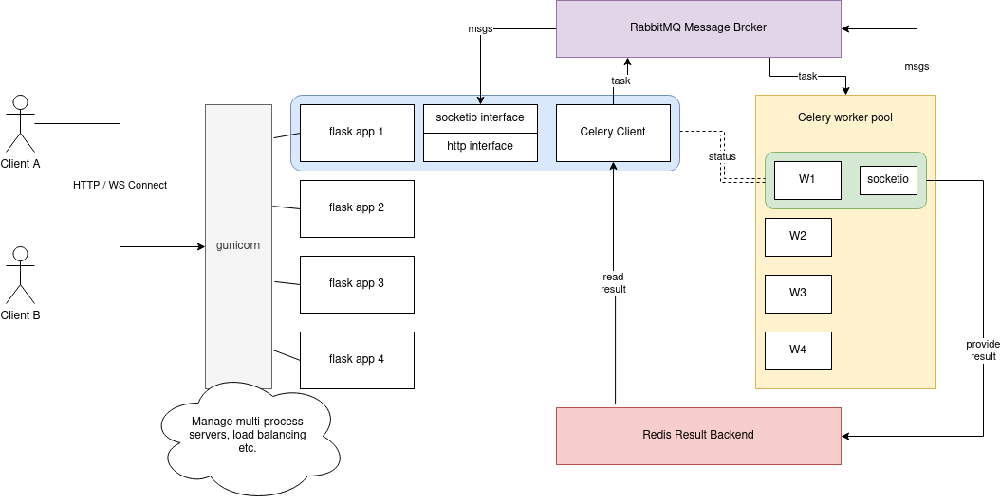

# PEER

PEER is a tool to support the peer review process of scientific papers.

For project maintainers: the central launch point is the [Wiki](https://git.ukp.informatik.tu-darmstadt.de/zyska/peer/-/wikis) of the GitLab Project.
For everyone: checkout this README for details on the code and an easy installation guide.

## Quick Start Guide
Before starting, check the system requirements and supported OS below.

1. Fetch and install all prerequisites:
```shell
sudo apt-get install git -y
git clone https://git.ukp.informatik.tu-darmstadt.de/zyska/peer.git
cd peer
sudo ./install.sh            # Install needed software packages
git submodule update --init  # get submodules after git clone
```

2. Change the environment variables in the `.env` file.

3. Start the docker containers in one terminal:
```shell
make docker
```

4. Initialize the database:
```shell
make init
```
5. Start our app in another terminal in development mode:
```shell
make dev
```
Note: This is the easiest way for development at the frontend with support by vite, where updates will pushed immediately to the website on any change. 
If you want to build the frontend first, you have to `make dev-build`. 
If you want to only restart the backend for development and use the already builded version of the frontend, you can use `make dev-backend`, 
but then you have to make sure you build the frontend first with `make build-frontend`.

6. Visit localhost:3001 in your browser. You should see a login page. Login via guest and access the default document 
   to start annotating.

## Installation Manual
There are two possible situation for an installation, which are explained below:
1. The **production** environment in order to generate data or use the software with the current state of development.
2. The **development** environment to further develop the software and test changes directly.

### Minimum Requirements
Both environments are tested with a clean Ubuntu 20.04 LTS Installation (minimal installation).

For production building you should have at least 4GB of RAM to run all containers
in parallel.

### Environment Setup
For all installations, we need the current data from the git repository and have to install some dependencies
    
    sudo apt-get install git -y
    git clone https://git.ukp.informatik.tu-darmstadt.de/zyska/peer.git
    cd peer
    sudo ./install.sh           # Install needed software packages

If something goes wrong, clean environment with ```make clean```.\

### Development Build

This will run the main development code locally (Note: The first run will take some time...).
Change to the root directory of this repo. We assume you didn't change any environment variables.

#### Basic Development Build
1. Start the docker container (e.g., postgres database) in one terminal.
```
make docker
```
2. Initialize the database. This should run through without an error; if there is an error, it
   might be that the postgres docker container wasn't started properly.
```
make init
```
3. Start our app in another terminal in development mode. Afterwards you can check on the
   PEER tool at [localhost:3001](http://localhost:3001) and see the landing/login page.
```
make dev # Build everything and start content-server
```

### NLP Server Development Build

For the NLP server we need to start the proper auxiliary services and load the
right configuration. For developing the NLP server you can run the NLP server
and celery worker natively while leaving the AMQP broker and result backend in 
docker containers. To do so, simply run the following commands in individual 
terminals:

```shell
make nlp_services

make nlp_celery

make nlp_dev

#only needed if you want to test functions from within the frontend
#note currently the order of commands is important because retrying is not implemented
make dev  
make docker
```

### NLP Server Deployment Build

If you know that you won't make any changes to the NLP server and instead want
it up and running for development in the frontend, you can and should run the
dockerized NLP server with services. For this purpose run:

```shell
#TODO TBA
```

### Production Build

The software will be installed in a Docker environment and in production mode. Run the
following command in the first terminal (takes quite a while until all containers
are up; in the range of 10-15min depending on your device):

    make build

Now, to initialize the DB run: 
    
    make init

The Content-Server should be available on port 3001.\
Please make sure that the other ports are **not accessible** from outside, this applies above all for  the PostgreSQL Database!

__Hint:__  Use [Portainer CE](https://hub.docker.com/r/portainer/portainer-ce) for managing the docker containers with a GUI.\
For installation see [Install Instructions](https://docs.portainer.io/v/ce-2.9/start/install/server/docker/linux)


## Architecture

This section gives an overview on the components and architecture of the complete PEER tool.
For further details, please consider the respective README files in the subdirectories.

__Remark__: You can use either the [PyCharm Plugin](https://plugins.jetbrains.com/plugin/15635-diagrams-net-integration) as well as the [Website](http://app.diagrams.net) \
(For Pycharm Dark Mode User set it to Light (Kennedy) under Settings -> Languages & Frameworks -> diagrams.net) to view the diagrams.

__Note:__ If you change anything on the structure, also update the architecture files!



### Architecture of the NLP Server




## Code Structure

The code is structured in three main components: the backend and frontend of the _content server_ 
and the _NLP server_ acting as a service to the backend (third tier). The code is grouped accordingly.

```
> backend         # backend of content server (express-based)
> frontend        # frontend of content server (vue-based)
> nlp             # nlp server
> docs            # all documentation files (e.g. diagrams) go here
> resources       # resource files used during building/configuring
```


## Frameworks

See also the architecture overview for further information how the frameworks interact!

### Frontend

- [Vue 3](https://vuejs.org/) - Progressive JavaScript Framework
  - [Vuex](https://vuex.vuejs.org/) - State Management
  - [Vue Router](https://router.vuejs.org/) - Official Router for Vue.js
  - [Vue 3 - socket.io](https://www.npmjs.com/package/vue-3-socket.io) - Socket.io Client for Vue3
  - [Vue 3 - bootstrap](https://www.npmjs.com/package/bootstrap-vue-3) - Bootstrap for Vue 3
- [PDFjs](https://mozilla.github.io/pdf.js) - to display the PDFs
- [Bootstrap 5](https://getbootstrap.com/) - Responsive frontend toolkit
  
### Backend

- [Sequelize](https://sequelize.org/) - Database Management System
- [PostgreSQL](https://www.postgresql.org/) - Used Database
- [Passport](https://www.passportjs.org/) - Login Management
- [Express](https://expressjs.com/de/) - Webserver
- [Socket.IO](https://socket.io/) - Bidirectional and low-latency websocket connection

__NLP Server__:
- [Grobid](https://github.com/kermitt2/grobid) for document parsing in the NLP server
- [Flask](https://flask.palletsprojects.com/en/2.1.x/) as a basic http server 
- [socketio](https://flask-socketio.readthedocs.io/en/latest/) for websocket communication
- [Celery](https://docs.celeryq.dev/en/stable/getting-started/introduction.html) for running
  compute tasks


