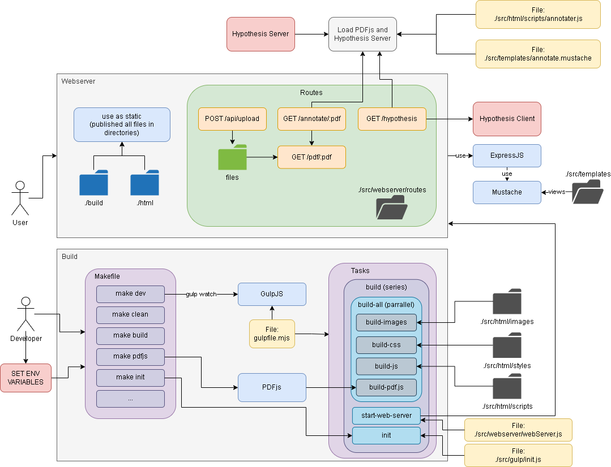

# Content Server

## Description
This directory contains all files to serve the frontend website to the user.

## Architecture
For an overview of the complete architecture, see ./docs/architecture.drawio\
(You can use either the [PyCharm Plugin](https://plugins.jetbrains.com/plugin/15635-diagrams-net-integration) as well as the [Website](http://app.diagrams.net))\
__Note:__ If you change anything on the structure, also update the architecture file!

### Architecture of the Content Server



## Installation

There are two possible situation for an installation:
1. The **production** environment in order to generate data or use the software with the current state of development.
2. The **development** environment to further develop the software and test changes directly.

For all installations, we need the current data from the git repository and have to install some dependencies
    
    sudo apt-get install git
    git clone --recursive https://git.ukp.informatik.tu-darmstadt.de/zyska/peer.git
    cd peer/content-server
    chmod +x install.sh
    sudo ./install.sh           # Install needed software packages

Both is tested with a clean Ubuntu 20.04 LTS Installation (minimal installation).\
If something goes wrong, clean environment with ```make clean```.

### Installation for Production 

The software will be installed in a Docker Environment. 

    sudo make docker

The Content-Server should be available on port 80.\
Please make sure that the other ports are **not accessible** from outside, this applies above all for  the PostgreSQL Database!

__Hint:__  Use [Portainer CE](https://hub.docker.com/r/portainer/portainer-ce) for managing the docker containers with a GUI.\
For installation see [Install Instructions](https://docs.portainer.io/v/ce-2.9/start/install/server/docker/linux)

### Installation for Development

This will run the main development code locally in addition to some docker container (i.e., PostgreSQL).

    sudo npm install --global yarn      # if yarn is not installed yet
    sudo npm install --global gulp-cli  # needed for pdf.js
    make dev     # Build only the content-server 

Here the Hypothesis Server should be running. 
You can either start the docker container with

    make h_server_docker

or build a local environment with in an extra console (in directory content-server):

    make h_server 

## Setting up hypothesis server

### Short way
1. Change Environment Variables in Makefile
2. `make init`

### Long way

1. Add admin account to hypothesis server:


    cd frameworks/hypothesis/h
    tox -qe dev -- sh bin/hypothesis --dev user add --username <username> --email <email> --password <password>
    tox -qe dev -- sh bin/hypothesis --dev user admin <username>

2. Sign in on the hypothesis server: http://localhost:5000/
3. Create oAuth client token: http://localhost:5000/admin/oauthclients/new
4. Create oAuth

  
    Name: < custom name > 
    Authority: localhost 
    Grand type: authorization_code
    Trusted: Yes
    Redirect URL: http://localhost:5000/app.html

5. Get Client ID and add it into the Makefile!

## Frameworks
- [Git Submodules](http://git-scm.com/book/en/v2/Git-Tools-Submodules) are used to include the following frameworks:
    - [PDFjs](https://mozilla.github.io/pdf.js) - to display the PDFs
    - [Hypothesis](https://web.hypothes.is/) - to annotating text in the PDFs
  
__Note__: See also the architecture overview for further information how the frameworks interact!

### Build Frameworks individually

    make pdfjs     # build PDFjs Framework
    make h_client  # build Hypothesis Client
    make h_server  # build Hypothesis Server

### Further information about the Hypothesis Framework

* Client setup manual: https://h.readthedocs.io/projects/client/en/latest/developers/developing/#setting-up-a-client-development-environment
* Server setup manual: https://h.readthedocs.io/en/latest/developing/install/#you-will-need
* Connecting Server & Client: https://h.readthedocs.io/en/latest/developing/integrating-client/
* Creating a User and Accessing the Admin Interface: https://h.readthedocs.io/en/latest/developing/administration/
* Hypothesis API:  https://h.readthedocs.io/en/latest/api-reference/v1/
* Hypothesis Server DOC: https://h.readthedocs.io/_/downloads/en/latest/pdf/
* Hypothesis Client DOC: https://h.readthedocs.io/_/downloads/client/en/latest/pdf/ 
* Server git repo: https://github.com/hypothesis/h 
* Client git repo: https://github.com/hypothesis/client
