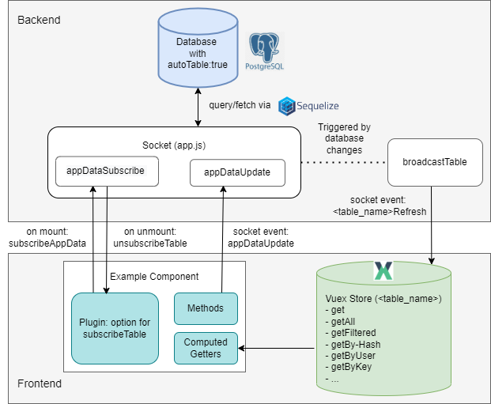

Data Transfer
=============

.. _data-transfer:

CARE implements a **data subscription mechanism** between the backend and the frontend, enabling real-time collaboration and automatic synchronization of database tables with the Vuex store in the frontend application.

.. _data-flow:

Data Flow
---------

-----

**Prerequisites**

- **Model** sets ``autoTable = true`` to be mirrored into Vuex.
- **Component** declares ``subscribeTable: ["<table>"]`` (or object form) to receive pushes.

Step-by-step (Backend → Frontend)
~~~~~~~~~~~~~~~~~~~~~~

1. **DB model (top-center “Database”)**: The model sets ``autoTable = true`` to enable automatic Vuex store table creation and participate in app data sync.

2. **Subscribe (bottom-left “Example Component” → center “Sockets”)**: On mount, the ``subscribeTable`` plugin emits ``subscribeAppData`` for each table to **Sockets (AppSocket, center)**; the server returns a ``subscriptionId``.

3. **Access-aware filtering (center “Sockets” ↔ top-center “Database”)**: Before sending any data, **Sockets** applies the model’s ``accessMap`` / ``publicTable`` via ``getFiltersAndAttributes`` so each socket only receives permitted rows/columns.

4. **Initial snapshot (center “Sockets” → bottom-right “Vuex Store”)**: The server calls ``sendTable`` and emits ``<tableName>Refresh`` to the **Vuex Store (right)** with the current rows. The **same event name** is used later for updates.

5. **Socket write (optional; bottom-left “Example Component” → center “Sockets”)**: The frontend emits ``appDataUpdate`` with ``{ table, data }`` to create or update rows.

6. **Backend transaction (center “Sockets” → top-center “Database”)**: ``updateData`` validates, applies defaults, and enforces access; inside a transaction it persists changes to the **Database (top-center)**. On **commit** (``afterCommit``) the server aggregates changed rows of ``autoTable`` models. See also: :ref:`MetaModel behavior <metamodel-behavior>` for the shared logic used in ``updateData``, including soft-deletion, access filtering, and hook handling.

7. **Broadcast (center “Sockets” → right “Vuex Store”)**: ``broadcastTable`` re-applies per-socket visibility with ``getFiltersAndAttributes`` (admins/public can bypass) and emits ``<tableName>Refresh`` only to relevant subscribers; **Vuex (right)** receives the deltas.

8. **Vuex merge (right “Vuex Store”)**: Each autoTable module handles the ``<tableName>Refresh`` mutation and merges rows (see ``refreshState``); ``refreshCount`` increments.

9. **Computed → Component (lower-left “Computed Getters” → bottom-left “Example Component”)**: Components read via Vuex getters (e.g., ``getAll``, ``getFiltered``); computed properties update and the **Component** re-renders automatically.

.. tip::
   **Two directions in the diagram**

   - **Downstream:** ``<tableName>Refresh``: (Sockets → Vuex) is used for the **initial snapshot** and all **delta updates**.
   - **Upstream:** ``appDataUpdate``: (Component → Sockets) performs a write; after commit the server pushes ``<tableName>Refresh`` to keep everyone consistent.

**Unsubscribe (on unmount; bottom-left “Example Component”)**

The component emits ``unsubscribeAppData(subscriptionId)``; the socket removes the subscription so no further ``<tableName>Refresh`` events are delivered.

sendTable 
~~~~~~~~~

- **Purpose**: send the current snapshot for a table and emit updates to the client.
- **Preconditions**: only works for models with ``autoTable = true``; otherwise it no-ops with a log.
- **Filtering**: starts with ``{ deleted: false }`` and OR-adds any provided ``filter``; then applies per-socket access via ``getFiltersAndAttributes`` (may also add allowed columns).
- **Attributes**: excludes sensitive fields by default (e.g., ``deleted``, ``deletedAt``, ``updatedAt``, ``rolesUpdatedAt``, ``initialPassword``, ``passwordHash``, ``salt``).
- **Injects**: supports ``{ type: "count", table, by, as }``; counts related rows and injects the result into each entry as ``as``.
- **Related tables**: if the model’s ``autoTable.foreignTables`` or ``autoTable.parentTables`` are set, it also fetches those and emits ``<relatedTable>Refresh`` for them.
- **Emit & return**: always emits ``<tableName>Refresh`` with the rows and returns the same data.

AppDataUpdate Socket
--------------------

The ``appDataUpdate`` socket is the generic way to **create or update rows** in models with ``autoTable = true``. It is defined in ``backend/webserver/sockets/app.js`` inside the ``AppSocket`` class:

.. code-block:: javascript

    /**
     * Update data for a specific table to the client.
     *
     * Acts as a wrapper around the underlying `updateData` method, using a Sequelize
     * transaction if provided, and returns the outcome to the caller.
     *
     * @socketEvent appDataUpdate
     * @param {Object} data The input data from the frontend
     * @param {String} data.table The name of the table to update
     * @param {Object} data.data New data to update
     * @param {Object} options Additional configuration parameter
     * @param {Object} options.transaction Sequelize DB transaction options
     * @returns {Promise<*>} A promise that resolves with the result from updateData
     */
    async updateAppData(data, options) {
      return await this.updateData(data, options);
    }

This method wraps the internal ``updateData`` logic. It checks access permissions, validates required fields, applies defaults, and then either **creates a new row** or **updates an existing one**. All operations run inside a transaction, and on commit the modified rows are broadcast to subscribed clients (see :ref:`data-flow`).

When to use 
~~~~~~~~~~~

- **Create** a new row in an autoTable model — omit ``id`` or set it to ``0``.
- **Update** an existing row — include ``id`` and the fields to change.
- **Soft-delete / quick state toggles** — include ``id`` with one of ``deleted``, ``closed``, ``public`` or ``end``; the server updates immediately.
- **Not for reads** — data is delivered via ``<tableName>Refresh`` after you subscribe with ``subscribeAppData``.
- **Don’t use** for non-``autoTable`` models or bulk/admin maintenance — use dedicated endpoints instead.

How to use
~~~~~~~~~~

From the frontend you call:

.. code-block:: javascript

    this.$socket.emit("appDataUpdate", {
      table: "<table_name>",  // must be an autoTable model
      data: { /* fields */ }  // include id for updates, omit for create
    }, (result) => {
      if (result.success) {
        // result.data contains the new or updated id
      } else {
        // result.message contains a human-readable error
      }
    });

.. tip::
   - **Create**: omit ``id`` or set it to ``0``  
   - **Update**: include ``id``  
   - **Quick state toggles**: if you send an ``id`` with ``deleted``, ``closed``, ``public`` or ``end``,
     the server will update immediately without requiring other fields.

.. reminder::
   ``appDataUpdate`` only works for models with ``autoTable = true``. For the definition of models, see :doc:`Database <database>`.

**Example usage in the frontend**

A typical usage pattern is emitting the socket event and showing a toast depending on the result.

.. code-block:: javascript

    // Close a study (from Study.vue)
    this.$socket.emit("appDataUpdate", {
      table: "study",
      data: { id: studyId, closed: true }
    }, (result) => {
      if (result.success) {
        this.eventBus.emit('toast', {
          title: "Study closed",
          message: "The study has been closed",
          variant: "success"
        });
      } else {
        this.eventBus.emit('toast', {
          title: "Study closing failed",
          message: result.message,
          variant: "danger"
        });
      }
    });

.. important::
   The server response has the shape: ``{ success: true, data: <id> }`` on success, or  ``{ success: false, message: "<error>" }`` on failure.

   **Fast path:** If ``id`` is present and any of ``deleted``, ``closed``, ``public`` or ``end`` is included, the server updates the row immediately via ``updateById`` (skips required-field checks and nested recursion). ``closed: true`` is stored as a timestamp. After commit, the change is broadcast via ``<tableName>Refresh`` as usual.

Backend Update Logic
~~~~~~~~~~~~~~~~~~~~

Typical component actions map to small ``appDataUpdate`` calls:

- **Delete** - soft-delete a row:

  .. code-block:: javascript

     this.$socket.emit("appDataUpdate", { table: "user", data: { id, deleted: true } }, cb);

- **Convert to child item**: Create/update a **parent** and send **child** rows in an array field. The server detects ``fields`` of type ``table`` and **recursively** runs updates for each child, injecting the parent’s foreign key.

- **Fast-path updates**: If an entry has an ``id`` and includes one of ``deleted``, ``closed``, ``public`` or ``end``, it is updated immediately without requiring other fields (schema required-field checks are skipped for these toggles).

- **Timestamp semantics for** ``closed``: The backend stores ``closed`` as a **timestamp**. Passing ``{ closed: true }`` sets it to the current time (see ``MetaModel.updateById``).

**Important details**

- **Validation**: On create, required fields are checked and defaults are applied if not set through the frontend.
- **Access control**: if ``userId`` is provided, the server verifies the caller is allowed to update for that user.  
- **Nested tables**: if the model defines fields of type ``table``, the server recursively calls ``updateData`` to update child rows.  
- **Broadcasts**: after a successful commit, all subscribed clients receive the updated data automatically.

.. _table-refresh-events:

Store Updates & ``<table>Refresh`` Events
~~~~~~~~~~~~~~~~~~~~~~~~~~~~~~~~~~~~~~~~~

Sockets broadcast table changes via events named ``<tableName>Refresh``. Each autoTable module
registers a mutation with that exact name and merges incoming rows using ``refreshState``.

**Mutation shape (generated per table):**

.. code-block:: javascript

   [websocketPrefix + table.name + "Refresh"]: (state, data) => {
     // table-specific pre-processing (e.g., annotation/comment tweaks) may occur here
     refreshState(state, data, (table.name !== "tag"));
     state.refreshCount++;
   }

**Merge behavior:**

The helper function ``refreshState`` determines how incoming rows are handled:

- Existing entries with the same ``id`` are **overwritten** with the new data.
- Entries with ``deleted: true`` are **removed** from the Vuex store (if ``removeDeleted`` is `true`).

.. code-block:: javascript

   export function refreshState(state, data, removeDeleted = true) {
     if (!Array.isArray(data)) data = [data];
     data.map((entry) => {
       if (!entry.deleted) {
         state.data[entry.id] = { ...state.data[entry.id], ...entry };
       } else if (removeDeleted) {
         delete state.data[entry.id];
       }
     });
   }

.. tip::
   If you don’t see updates, verify:

   1) the model has ``autoTable = true``,
   2) the component declared ``subscribeTable: ["<table>"]``,
   3) the same ``<tableName>Refresh`` mutation fires for the **initial snapshot** and later **updates** (check Vue devtools).

Frontend access patterns and the list of available getters are documented in :doc:`Vuex Store <../frontend/vuex_store>`.
For inspecting Vuex modules, socket messages, and mutations with browser devtools, see :doc:`Debugging <../debugging/index>`.

Subscribe DB in the Frontend (when & where)
~~~~~~~~~~~~~~~~~~~~~~~~~~~~~~~~~~~~~~~~~~~

Use ``subscribeTable`` in route views or components that actively display changing table data; unsubscription happens automatically on unmount.

On mount, the plugin checks for a component option ``subscribeTable`` and emits ``subscribeAppData`` for each entry; on unmount it emits ``unsubscribeAppData(subscriptionId)``. The server tracks subscriptions per socket in ``socket.appDataSubscriptions`` (``ids``, ``tables``, ``merged``) and uses them to decide which clients receive updates.

.. code-block:: javascript

  // Minimal usage (string form)
  export default {
    subscribeTable: ["nav_element"]
  }

.. code-block:: javascript

  // Object form supports optional filter/inject
  export default {
    subscribeTable: [
      "nav_element",
      { table: "document",
        filter: [{ projectId: 42 }],
        inject: [{ type: "count", table: "comment", by: "documentId", as: "comments" }]
      }
    ]
  }

Accessing the Vuex Store in Components
--------------------------------------

Use the generated getters under the ``table/<name>`` namespace directly in ``computed``:

.. code-block:: javascript

   computed: {
     // all documents
     documents() {
       return this.$store.getters["table/document/getAll"];
     },

     // filtered by project
     projectDocuments() {
       const pid = this.$store.getters["settings/getValueAsInt"]("projects.default");
       return this.$store.getters["table/document/getFiltered"](d => d.projectId === pid);
     },

     // single by id
     doc() {
       return this.$store.getters["table/document/get"](this.$route.params.id);
     }
   }

Available getters per autoTable module:

- ``get(id)`` → object by id
- ``getAll()`` → all rows
- ``getFiltered(fn)`` → filter predicate
- ``getByHash(hash)`` → first row by hash
- ``getByUser(userId)`` → rows by userId
- ``getByKey(key, value)`` → rows where ``row[key] === value``
- ``length`` → number of rows
- ``refreshCount`` → number of times the table has been refreshed
- ``hasFields`` / ``getFields`` → schema metadata if available

Collaboration Use Case
~~~~~~~~~~~~~~~~~~~~~~

This subscription system enables **real-time collaboration**:

- If one user modifies a row (e.g., adds an annotation), all other users subscribed to the same table
  immediately receive the updated data.
- By maintaining a per-user subscription list, the backend ensures that **only relevant users** are notified
  about changes.

This approach avoids polling and keeps all connected clients synchronized with the authoritative state
in the database.
