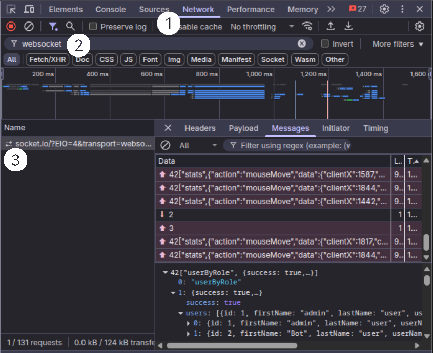
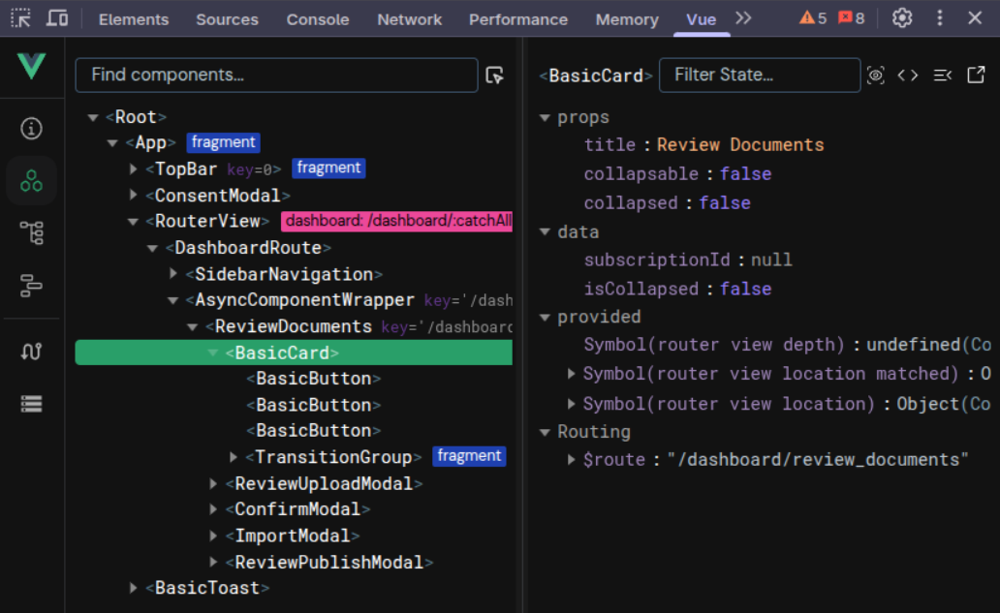

Debugging
=========

During development it is often necessary to get some insights into the different aspects of the application.
Thereby, a few methods have been found to be very helpful in accelerating the programming process.
Some of them are already describe inside the other sections of this documentation, but here they are listed again for convenience.

General
-------

Within the Development Mode (i.e. when running ``make dev``), we enabled different debugging options supporting you in the development process.
For example, the backend will log everything to the console, and the frontend will not minify the code. Also, the frontend will automatically reload the page when you change the code (i.e., hot loading).
Furthermore, the debugging options for vue.js are enabled, such that you can use the vue.js devtools to inspect the application.

.. tip::

    Use console.log() to print out the values of variables and objects.
    To help you find the output in the console, you can use some kind of prefix, e.g. ``console.log("debugging output: ", myVar);``.
    Remember that logging in backend is displayed in your terminal, while logging in frontend is displayed in your browser console (i.e., Developer tools).

Browser Developer Tools
-----------------------

Most of the commonly used browser support debugging tools, such as the developer console, the network tab, and the vue.js devtools.
The developer console is a very powerful tool, which allows you to inspect the DOM, the CSS, and the JavaScript code.
In the following, we will describe some of the most useful features of the developer console.

Inspect Websocket Connection
~~~~~~~~~~~~~~~~~~~~~~~~~~~~

The websocket is used to communicate between the frontend and the backend. It is often necessary to inspect the websocket connection to see what data is sent and received between the frontend and the backend.

To do so:

1. Open the developer console and go to the network tab.
2. Reload the page and at filter for ``websocket``.
3. The websocket connection should be listed there. Click on it to see the details.

On the On the ``Message`` tab (or ``Responses``), you can see the messages that are transmitted between the frontend and the backend.

.. note::

    If messages are not immediately visible, refresh the page to ensure all WebSocket communications are captured.

Inspect Vue.js Components
~~~~~~~~~~~~~~~~~~~~~~~~~

The vue.js devtools are a very powerful tool to inspect the vue.js components and they are browser extensions that can be installed from the Chrome Web Store (for Chrome/Edge) or Firefox Add-ons (for Firefox).
Simply search for "Vue.js devtools" in your browser's extension store and install the official extension by Vue.js.
Once you have installed the vue.js devtools in your browser, you can open it by clicking on the ``Vue`` tab in the top bar of the developer tools. 
(You might also have to unfold the top bar to see the ``Vue`` tab.)

**Component Inspector Tool:**

In the ``Components`` panel (the second icon from the left panel in the Vue.js DevTools), you can see all the components that are currently loaded in the application, including their data, props, computed properties, and event listeners.
It also provides a special component inspector tool (the cursor/mouse icon in the top-right corner of the ``Components`` panel) that allows you to:

1. Click the inspector icon (it shows "Select component in the page" on hover)
2. Hover over any element on the webpage to highlight the corresponding Vue component
3. Click on an element to select its Vue component in the component tree

This tool is particularly useful for:

- Quickly finding which Vue component is responsible for a specific part of the UI
- Understanding the component hierarchy in complex interfaces
- Debugging component rendering issues

A very useful feature of the vue.js devtools is the ``Vuex`` module (the icon at the bottom of the left panel).
It allows you to inspect the state of the application, including the state of the different vuex modules.
Sometimes, it is necessary to reload the page again to see the vuex tab in the vue.js devtools.

**Quick Vuex Debugging Tips:**

- Use the Vuex tab to monitor state changes in real-time
- Check the mutation log to see what actions are modifying the state
- Use the "Time Travel" feature to step back through state changes
- Export/import state for testing different scenarios

.. tip::
   
   If Vuex tab doesn't appear, ensure:
   
   - Vue.js DevTools extension is installed and enabled
   - You're running in development mode (``make dev``)
   - The page has been refreshed after installing the extension
   - Vuex store is properly configured in your application

Stopping open processes
-----------------------

Sometimes during development, the backend will throw an error, which is not handled by the application itself.
In that case, the backend will stop working but the process will not be terminated and a error message "Error: listen EADDRINUSE: address already in use :::3001" will be displayed in the terminal.
In such a case, you have to terminate the process manually in the system monitor.
To find the process, you can search for ``node`` in the system monitor.
If you are sure no other node process is running, you can also terminate the process by executing ``killall node`` in the terminal.

Importing a Production Database Locally
---------------------------------------

Sometimes you need the exact data that lives in the production system to reproduce or
diagnose a bug.  The workflow below shows how to **export** the production database and
static files, copy them to your workstation, and **restore** them for offline debugging.

.. _db-backup-export:

Export on the production server
~~~~~~~~~~~~~~~~~~~~~~~~~~~~~~~

.. code-block:: shell

    # 1 – Find the running Postgres container (the name will be always like <project_name>-postgres-1)
    docker ps | grep <project_name>

    # 2 – Create the dump (Makefile target)
    make CONTAINER=<project_name>-postgres-1 backup_db

    # 3 – Inspect the dump folder
    ls -l db_dumps/

    # 4 – Prepare a non-root backup location
    mkdir -p /opt/backups/<project_name>/$(date +%d-%m-%Y)/

    # 5 – Copy the dump and related files
    cp db_dumps/dump_dd-mm-yyyy_xx_yy_zz.sql \
       /opt/backups/<project_name>/dd-mm-yyyy/
    cp -r ./files /opt/backups/<project_name>/dd-mm-yyyy/

.. _db-backup-download:

Transfer files and restore on the local development environment
~~~~~~~~~~~~~~~~~~~~~~~~~~~~~~~~~~~~~~~~~~~~~~~~~~~~

Now that we have the database dump and related files in the backup directory on the deployment server, we need to transfer them to your local development environment.
Since this is a git repository, you'll need to manually copy these files to your local working directory.
The files (.pdf & .delta) are necessary to restore the production data on the local development environment, otherwise the actual data points behind the document entries and studies cannot be found.

.. code-block:: shell

    # 1 – Create matching target folders
    mkdir -p ~/projects/<project_name>/db_dumps
    mkdir -p ~/projects/<project_name>/files

    # 2 – Download the dump
    scp username@yourServer.domain:/opt/backups/<project_name>/dd-mm-yyyy/dump_dd-mm-yyyy_xx_yy_zz.sql \
        ~/projects/<project_name>/db_dumps/

    # 3 – Download / Overwrite related files (LaTeX, PDFs, uploads, etc.)
    # If your shell interpreter doesn't need the apostrophe, please remove them from the source path.
    scp -r username@yourServer.domain:`/opt/backups/<project_name>/dd-mm-yyyy/files/*` \
        ~/projects/<project_name>/files/

.. _db-backup-restore:

From the **project root** (where the ``Makefile`` is located):

.. code-block:: shell

    make clean                        # drop any existing local database
    make docker                       # build & start the Postgres container
    make init                         # create empty tables / seed data
    make recover_db CONTAINER=<project_name>-postgres-1 \
                    DUMP=dump_dd-mm-yyyy_xx_yy_zz.sql     # DUMP is just the file name, because the Makefile already prefixes it with `db_dumps/`

.. note::

   When switching between different branches, be aware that the database will be preserved, but the files in the ``.files`` directory might be affected. 
   If you encounter issues with missing files after switching branches, you may need to manually restore the files from your backup.
   A recommended way is to make a copy of the ``.files`` folder on a backup directory locally.

Your local instance now should run with the freshest production data, so you can
reproduce bugs and test fixes without touching the live system.
