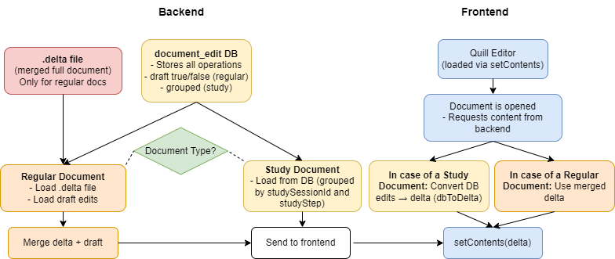

Quill Editor 
============

The Editor component is a delta-based Quill Editor used for editing documents. 
When the Editor is initialized, it is capable of handling text changes and processing deltas to update the database. 

Key features include:  
  - Handling text changes and debouncing these changes
  - Managing the content, formatting, and styling of the document
  - Configuring and customizing the toolbar
  - Exporting the document as HTML and full access to delta files

Overview
--------

This documentation is intended to help understand the codebase for the editor built using Quill. 
It outlines the connections and configurations necessary for extending the editor and provides instructions for logging user interactions, running unit tests, managing modules, and handling database migrations.

Implementing the Editor
-----------------------

To implement and use the editor, orient yourself on the existing implementation in the codebase. 
The following sections describe the key aspects and present basic code examples.

**Initialization and Configuration**

The editor should be properly initialized and configured. This involves setting up the editor container, initializing the editor instance, and configuring toolbar options and themes.

.. code-block:: javascript

    import Editor from '@/components/editor/Editor.vue';
    import { EditorStore } from './editorStore.js';

    export default {
      data() {
        return {
          editor: null,
        };
      },
      mounted() {
        const editorContainer = document.getElementById('<editor-container-id>');
        if (editorContainer) {
          this.editor = new Editor(editorContainer, {
            modules: {
              toolbar: true
            },
            theme: "snow"
          });
        }
      }
    };

Refer to ``frontend/src/components/editor/Editor.vue`` for the full implementation.

.. _debounce-ref:

**Debouncing of text changes**

Debouncing is used to limit the number of database updates during text changes, improving performance and reducing the number of requests sent to the backend.
The editor captures text changes using Quill's ``text-change`` event.

.. tip::

    Set the debounce time based on the expected frequency of text changes and the desired performance with the setting `editor.edits.debounceTime`. 
    
    (see: **Dashboard → Settings → Editor → Edits**).

**Toolbar Configuration**

The toolbar can be customized based on the study or document context. Its visibility and available tools are managed through centralized settings in the admin dashboard:

- ``editor.toolbar.visibility`` – Toggles the entire toolbar
- ``editor.toolbar.showHTMLDownload`` – Adds an HTML download button
- ``editor.toolbar.tools.bold``, ``editor.toolbar.tools.header``, etc. – Enable/disable individual formatting options

For a full list of available settings, refer to the :ref:`Editor Settings <editor-settings-ref>`.

If you're developing the platform or need to introduce a new setting key, see :ref:`Adding a New Setting <add-setting-example-ref>` for instructions.

.. _delta-overview-ref:

Delta Files and DB Edits
~~~~~~~~~~~~~~~~~~~~~~~~

CARE’s document system combines two types of storage formats:

- **Delta files** (stored as ``.delta`` files on disk) hold the last saved state of the document.
- **Database entries** (stored in ``document_edit``) contain atomic edits such as insertions, deletions, or attribute changes, including metadata like ``draft``, ``userId``, and ``offset``.

This diagram illustrates the high-level flow of how content is loaded into the Quill editor depending on the document type. It separates backend components on the left (.delta file and database) from the frontend (Quill Editor) on the right. The decision node “Document Type?” shows where the logic branches between **regular documents** and **study documents**, which behave differently.

.. raw:: html

      

**For regular documents**, two data sources are used:
  
  - The ``.delta`` file contains the latest fully saved state of the document.
  - The ``document_edit`` table contains all draft edits (with ``draft: true``) made since the last save.

  When the document is opened, both are merged server-side before being sent to the editor. This means the frontend always displays the full current document, even if there are unsaved changes.

**For study documents**, only the ``document_edit`` table is used. All edits are grouped by ``studySessionId`` and ``studyStepId``. No ``.delta`` file exists or is created. This allows the system to isolate content per session step, which is essential for study workflows.

During editing, the Quill editor emits changes as Deltas, which are sent to the backend via WebSocket and stored as new DB entries. These are always marked ``draft: true`` initially.

The autosave behavior is abstracted from the diagram for clarity, but works as follows:

- Only **regular documents** use autosave (triggered via the :ref:`Debounce Behaviour <debounce-ref>`.).
- When triggered, the backend:

  - Merges all current draft entries with the existing ``.delta`` file
  - Writes a new ``.delta`` file to disk
  - Marks the merged DB entries as ``draft: false``

This autosave process ensures that the ``.delta`` file reflects the latest persisted state of the document, while temporary edits remain in the database until committed.

Editor-Deltas and Code Integration
----------------------------------

This section explains the **technical implementation** behind the concepts introduced above, especially how delta files and DB entries are transformed and synchronized between the frontend and backend.

For a conceptual overview, see :ref:`Delta Files and DB Edits <delta-overview-ref>`.

What Are Deltas?
~~~~~~~~~~~~~~~~

A Delta is a JSON-based data structure used by Quill to represent changes to a document. It is composed of operations like ``insert``, ``delete``, and ``retain`` to express differences between document states.

For full reference, see the official Quill Delta documentation: https://quilljs.com/docs/delta/

Backend Integration
~~~~~~~~~~~~~~~~~~~

Location: ``utils/modules/editor-delta-conversion``

.. code-block:: javascript

    const { dbToDelta, deltaToDb } = require('editor-delta-conversion');
    const delta = dbToDelta(databaseEdits);
    const dbEntries = deltaToDb(quillDelta, documentId, userId);

This transformation logic is used in:

- ``backend/webserver/sockets/document.js`` – Handles real-time WebSocket updates
- ``backend/db/models/document_edit.js`` – Converts and saves edits to the database

Frontend Integration
~~~~~~~~~~~~~~~~~~~~

In ``Editor.vue``, the Quill instance interacts with the backend through delta objects:

.. code-block:: javascript

    this.quill.setContents(dbToDelta(edits));  // Load document
    const dbEntries = deltaToDb(changeDelta);  // Save edits

The frontend uses the WebSocket to push these deltas, which are then stored as draft DB entries.

Sorting of DB Edits
~~~~~~~~~~~~~~~~~~~

To reconstruct the document consistently, DB edits are sorted first by timestamp, then by an optional ``order`` field:

.. code-block:: javascript

    entries.sort((a, b) => {
      const timeCompare = new Date(a.createdAt) - new Date(b.createdAt);
      if (timeCompare !== 0) return timeCompare;
      return (a.order || 0) - (b.order || 0);
    });

This is critical when applying a series of granular changes to restore a document’s state.

Testing the Editor
------------------

To ensure the editor's functionality, comprehensive tests are written for the delta conversion functions. 
These tests verify the correct conversion between Quill Delta objects and database entries.

Unit Tests
~~~~~~~~~~

The unit tests cover the following categories:
  - Insert Operations Test
  - Deletion Operations Test
  - Attribute Operations Test

**Running the Tests**

The tests are located in ``utils/modules/editor-delta-conversion/tests/editor-delta-conversion.test.js``. 
To execute the tests, use the following command:

.. code-block:: bash

    make test-modules

**Example Test Data**

Test data for the delta conversion tests are stored in JSON files located in `utils/modules/editor-delta-conversion/tests/data/`. 
Each file contains both delta and database entry representations of the document.
