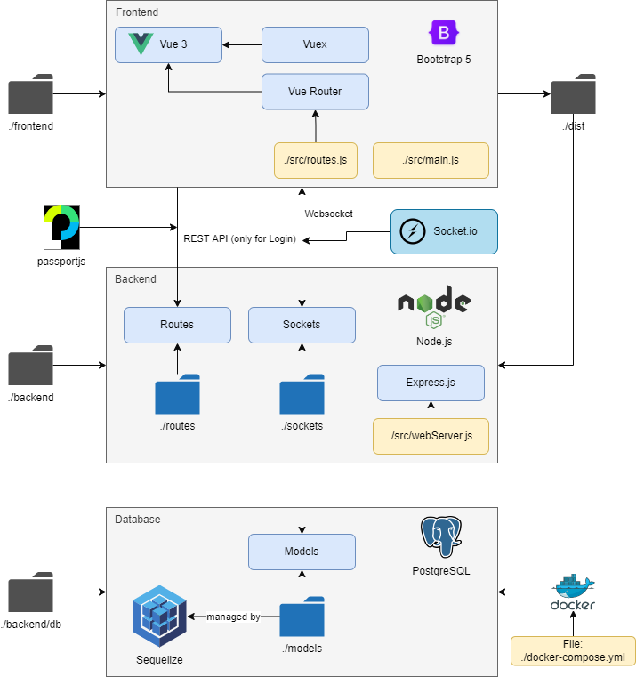

Quickstart
==========

Doing research with comments and highlights isn't difficult anymore. Properly configured, you can start using CARE
within a few minutes. Simply follow the :doc:`Installation <./installation>` instructions and visit http://localhost:9090.

If you want to get an high-level overview on CARE and understand what's going on under the hood,
we have compiled this very condensed quickstart guide.

System Architecture
-------------------

The CARE system architecture follows a classical client-server approach split in the three tiers:
    * frontend (presentation)
    * backend (app/logic)
    * external data services (data).

The frontend is realized as a monolithic Vue3.js application running in the browser of the clients, communicating with the backend via websockets and updating data.
The backend itself runs as an express server that listens to the clients and forwards data and service requests.
The last tier consists the database as the key component for persistent data and external services such as the NLP-Service enabling AI-assistance.

The code is structured accordingly:

.. code-block::

    > backend           # backend logic
      > db              # database management and interaction
      > webserver       # actual server and socket interface
      > tests           # webserver tests
      > utils           # utility functions

    > frontend          # frontend logic
      > src/assets      # static assets
      > src/auth        # authentication logic (i.e. login and register)
      > src/basic       # basic components (e.g. forms, buttons, etc.)
      > src/components  # main vue components of the application
      > src/plugins     # vue plugins
      > src/store       # vuex store - state management

    > docs              # documentation

The Frontend
------------
The frontend essentially consists of three major views:

    1. the landing page (login and register view)
    2. the dashboard (connecting all other views)
    3. the annotator (view for annotating documents)

All management functionality is realized within the dashboard.
If you intend to extend CARE, you usually add new components here.
The annotator includes the functionality to work with the document (e.g. sidebar showing comments).
If you want to add new document features, you would usually extend the annotator.

Structurally, the frontend architecture is made up of the following base components:
    * Vuex Store (data management),
    * Vue Router (view navigation),
    * Socket.IO (communication through websockets),
    * and the actual visual components (presentation)

The Backend
-----------
The backend consists of

    1. the actual webserver (connecting all parts)
    2. the database connection (for DB interaction and management)
    3. the REST interface (client authentication)
    4. the websocket interface (client communication)
    5. the external services (e.g. broker)

The webserver hosts the actual backend logic and provides the different communication interfaces.
If you want to extend CARE, you generally don't need to touch the webserver;
instead, you typically just need to update the database schema (migration),
extend the socket interface or add an external service.

Architecture Overview
---------------------

Paradigms
---------
Both frontend and backend follow an event-based design principle.
All communication takes place via websockets, to avoids busy waiting of typical polling behaviour,
reduces overhead and makes development for CARE lean and easy.
The message format follows a standardized naming schema.

**Frontend**
The frontend is mostly realized using a set of base components which ensure a consistent design and easy and quick extensibility.
All components are realized in Boostrap 5 to ensure a responsive design with wide browser support.

**Backend**
The backend defines a set of standard classes that make the extension of sockets, services and the database very quick.
Rights and access management is kept lean; enforcing access rules lies in the responsibility of the backend.

**Documentation**
The comprehensive documentation should enable usage and extension of the tool.
The documentation has to be kept up-to-date at all times;
all components, classes and methods are documented;
the socket API documentation is continuously updated.

**Testing**
Automatic testing is focused on the backend using the provided test framework.
The frontend undergoes rigorous manual testing before providing features on the main branch of the tool.