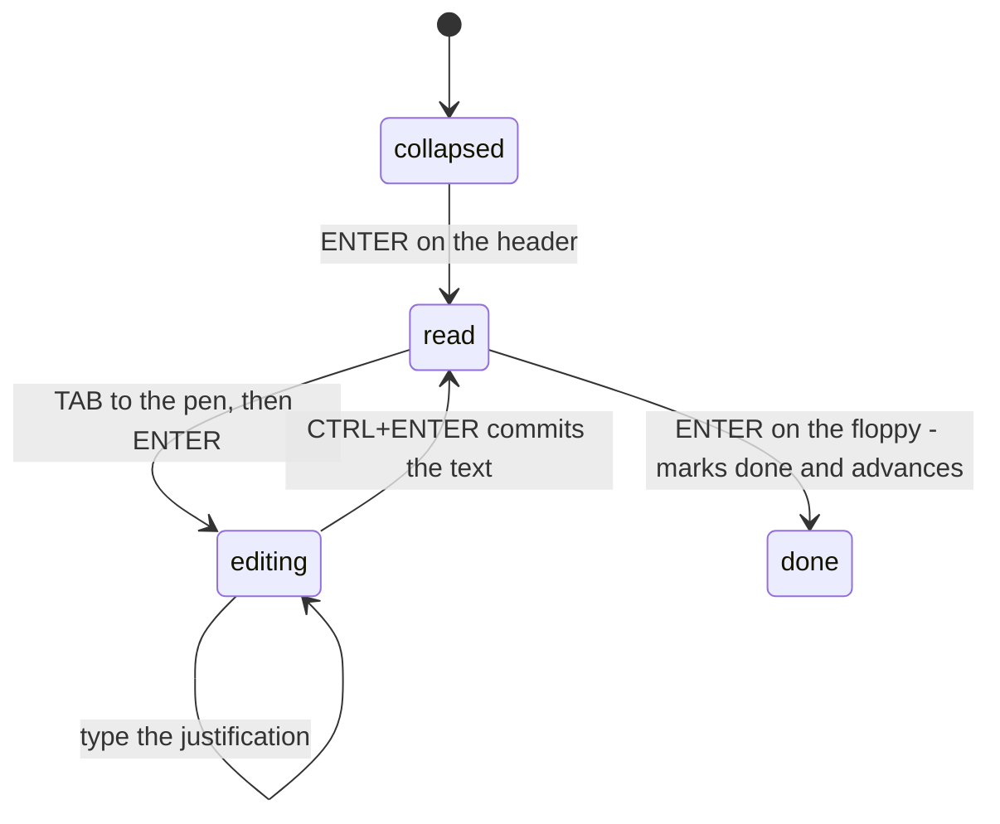
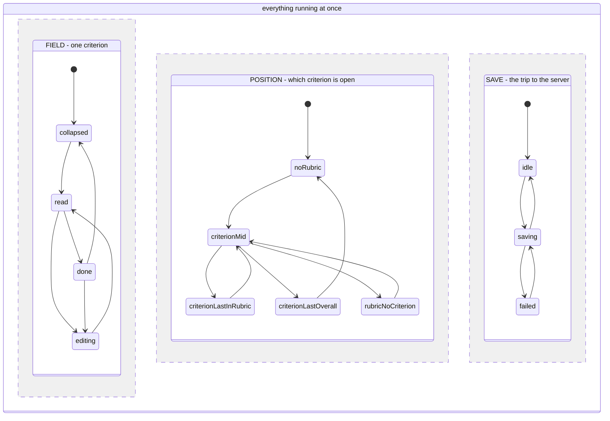
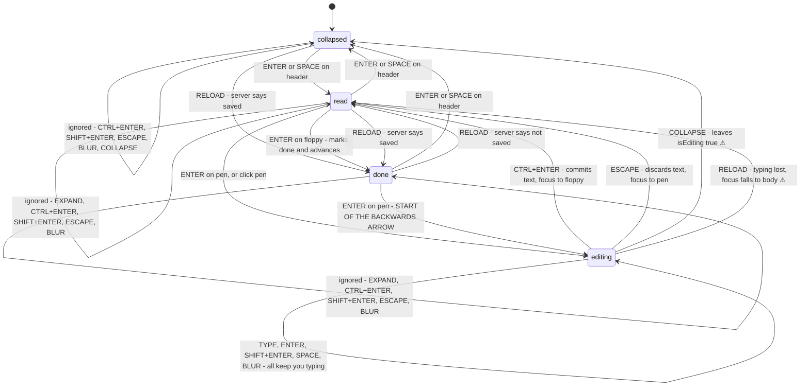
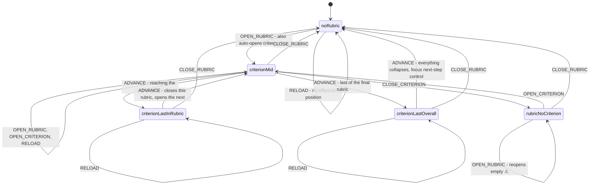
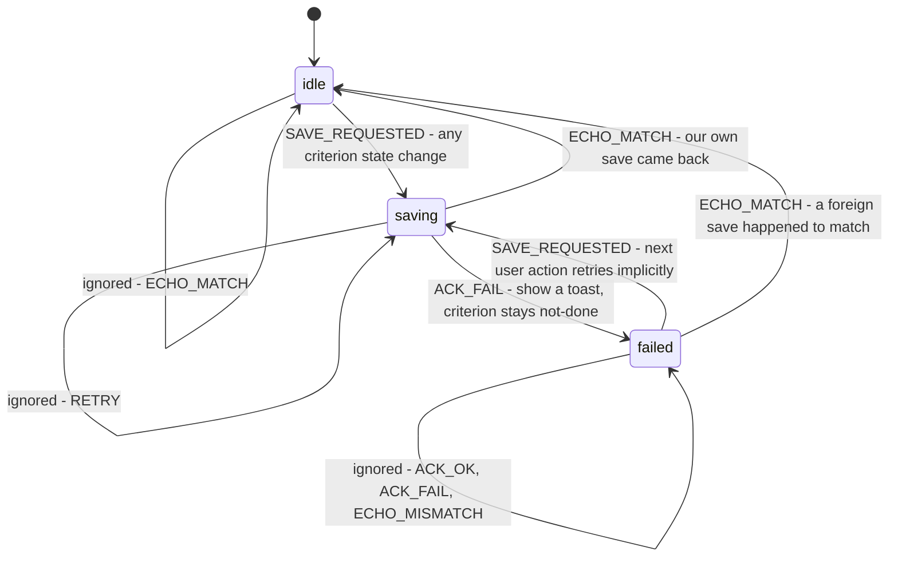

# CARE #220 — Assessment keyboard shortcuts: state machine

Specification written **before** implementation. The Vue components keep owning
`isEditing` / `isSaved`; handlers are written by hand to match this document and
`assessment-keyboard.machine.js`.

Three orthogonal regions (Harel AND-composition — they run at the same time and
all receive the same events):

| Region | Scope | What it tracks |
|---|---|---|
| field | one criterion | what the editor is doing |
| position | the whole step | which rubric/criterion is expanded |
| save | the whole assessment | the `documentDataSave` round trip |

Focus location (header / pen / floppy / textarea / cancel / none) is a
**variable**, not a fourth region — 4 field states × 7 focus locations would be
unreadable. It is checked by the oracle after every transition instead.

---

## How to read these diagrams

| What you see | What it means |
|---|---|
| a box | a situation the thing can be in |
| an arrow between two boxes | the user did something, and this is where it lands them |
| an arrow looping back to the same box | the event happened and **nothing changed** |
| `ignored` on a loop | nobody designed a behaviour for this — a **sneak path**, tested anyway |
| ⚠ on an arrow | an existing CARE bug, not introduced by this feature |
| the filled circle | where you start |

The loops matter as much as the arrows between boxes. Every key a user can
press in a given situation has to land somewhere, and "nowhere" is still an
answer that has to be checked.

---

## The loop we are building

This is the happy path — one criterion, filled in entirely from the keyboard.

Six presses per criterion, none of which move focus by surprise.

---

## The three regions at a glance

Three things are going on at the same time, and every keypress is offered to
all three.

---

## Field region

Every arrow the criterion can experience, including the ones where nothing
happens.

**What to point at.** Three things carry the talk. The `done → editing → read`
route, which un-finishes a criterion the user thought was done. The two ⚠
arrows out of `editing`, which lose typing. And the three `ignored` loops,
which are 18 of the 48 cells and the part nobody writes down.

**The backwards arrow.** `done → EDIT → editing → CTRL_ENTER → read`. Fixing a
typo in a finished justification un-finishes the criterion, because `saveEdit`
sets `isSaved: false` (AssessmentCriteria.vue:300). Under `forcedAssessment`
this un-completes the whole step until the user presses Enter once more.

### collapsed

| Event | → | Behaviour | |
|---|---|---|---|
| EXPAND | read / done | panel opens, `aria-expanded` true, focus stays on header | D |
| COLLAPSE | collapsed | idempotent no-op | S |
| EDIT | — | pen inside the `v-if`, not rendered | X |
| TYPE | — | no textarea | X |
| CTRL_ENTER | collapsed | ignored — only means "commit my typing" | S |
| ENTER | read / done | header focused → expand; focus elsewhere → nothing | D |
| SPACE | read / done | same as ENTER; must `preventDefault` or the page scrolls | D |
| SHIFT_ENTER | collapsed | ignored | S |
| ESCAPE | collapsed | ignored | S |
| BLUR | collapsed | no state change | S |
| MARK_DONE | — | floppy not rendered | X |
| RELOAD | read / done | stays collapsed, badge colour may change | D |

### read — expanded, `isEditing` false, `isSaved` false, grey badge

| Event | → | Behaviour | |
|---|---|---|---|
| EXPAND | read | already open | S |
| COLLAPSE | collapsed | `onCriterionToggle` sets index null | D |
| EDIT | editing | `!readOnly`; `startEdit`, focus to textarea | D |
| TYPE | — | no textarea | X |
| CTRL_ENTER | read | ignored | S |
| ENTER | varies | header → collapsed; pen → editing; floppy → done + advance | D |
| SPACE | varies | same branches, native button activation | D |
| SHIFT_ENTER | read | ignored | S |
| ESCAPE | read | ignored — nothing to cancel | S |
| BLUR | read | no state change | S |
| MARK_DONE | done | `!readOnly`; `saveAssessment`, emits `saved-and-next` | D |
| RELOAD | read / done | server data may set `isSaved` true | D |

### editing — textarea in DOM, `isEditing` true

| Event | → | Behaviour | |
|---|---|---|---|
| EXPAND | editing | already open | S |
| COLLAPSE | collapsed | panel unmounts, `isEditing` stays true ⚠ | D |
| EDIT | — | pen not rendered in the editing block | X |
| TYPE | editing | `autoResizeTextarea` | D |
| CTRL_ENTER | read | `!readOnly`; commit, focus to floppy; may un-complete the step | D |
| ENTER | editing | native newline, no `preventDefault` | D |
| SPACE | editing | native space character | D |
| SHIFT_ENTER | editing | native newline | D |
| ESCAPE | read / done | `cancelEdit`, typed text discarded, focus to pen | D |
| BLUR | editing | text stays uncommitted in `localAssessment` | D |
| MARK_DONE | — | floppy not rendered | X |
| RELOAD | read / done | `isEditing` forced false, typing lost, focus to body ⚠ | D |

### done — expanded, `isSaved` true, green badge

| Event | → | Behaviour | |
|---|---|---|---|
| EXPAND | done | already open | S |
| COLLAPSE | collapsed | as read | D |
| EDIT | editing | `!readOnly`; start of the backwards arrow | D |
| TYPE | — | no textarea | X |
| CTRL_ENTER | done | ignored | S |
| ENTER | varies | header → collapsed; pen → editing; floppy → advance only | D |
| SPACE | varies | same branches | D |
| SHIFT_ENTER | done | ignored | S |
| ESCAPE | done | ignored | S |
| BLUR | done | no state change | S |
| MARK_DONE | done | `!readOnly`; re-saves and advances | D |
| RELOAD | read / done | can drop to read if the server says not saved | D |

**Field tally:** 48 cells — 25 designed, 16 sneak, 7 impossible.

---

## Position region

| State | OPEN_RUBRIC | CLOSE_RUBRIC | OPEN_CRITERION | CLOSE_CRITERION | ADVANCE | RELOAD |
|---|---|---|---|---|---|---|
| noRubric | criterionMid **D** | — **S** | — **X** | — **X** | — **X** | noRubric **D** |
| rubricNoCriterion | rubricNoCriterion **D** | noRubric **D** | criterion* **D** | — **S** | — **X** | unchanged **D** |
| criterionMid | criterionMid **D** | noRubric **D** | criterionMid **D** | rubricNoCriterion **D** | criterion* **D** | unchanged **D** |
| criterionLastInRubric | criterionMid **D** | noRubric **D** | criterionMid **D** | rubricNoCriterion **D** | criterionMid **D** | unchanged **D** |
| criterionLastOverall | criterionMid **D** | noRubric **D** | criterionMid **D** | rubricNoCriterion **D** | noRubric **D** | unchanged **D** |

**Position tally:** 30 cells — 24 designed, 2 sneak, 4 impossible.

**History behaviour.** `expandedCriterionIndex` defaults to `0`
(AssessmentRubric.vue:150), so opening a rubric auto-expands its first
criterion. But `onCriterionSavedAndNext` sets it to `null` when a rubric
completes (line 209), and the component is not destroyed on collapse — only its
body is `v-if`'d. So a fresh rubric opens at criterion 0 and a completed rubric
opens showing nothing. Same action, two outcomes, nothing in the UI explains why.

---

## Save region

| State | SAVE_REQUESTED | ACK_OK | ACK_FAIL | ECHO_MATCH | ECHO_MISMATCH | RETRY |
|---|---|---|---|---|---|---|
| idle | saving **D** | — **X** | — **X** | idle **S** | idle **D** | — **X** |
| saving | saving **D** ⚠ race | saving **D** | failed **D** | idle **D** | saving **D** ⚠ | saving **S** |
| failed | saving **D** | failed **S** | failed **S** | idle **D** | failed **S** | — **X** |

**Save tally:** 18 cells — 11 designed, 4 sneak, 3 impossible.

**The race.** Two saves in flight: the second overwrites
`lastSavedAssessmentJson` (Assessment.vue:571). The first echo then fails the
equality check at line 296 and falls into `loadSavedAssessmentData`, which
resets `isEditing` to false for every criterion with saved data because it is
not persisted (lines 486–499). The keyboard loop fires three saves in about two
seconds where the mouse path takes ten or more — the feature does not cause the
bug, it shortens the window that hides it.

---

## Couplings between regions

| From | To | Effect |
|---|---|---|
| save `ECHO_MISMATCH` | field | forces `editing → read`, discarding uncommitted text (existing bug) |
| field `MARK_DONE` | position | emits `saved-and-next`, driving ADVANCE |
| field `CTRL_ENTER` + `forcedAssessment` | step completion | flips false — the backwards arrow |
| position `ADVANCE` | field | new criterion enters read or done per its stored `isSaved` |
| field any state change | save | fires SAVE_REQUESTED — why the loop is save-heavy |

---

## Totals

| | Designed | Sneak | Impossible | Cells |
|---|---|---|---|---|
| field | 25 | 16 | 7 | 48 |
| position | 24 | 2 | 4 | 30 |
| save | 11 | 4 | 3 | 18 |
| **total** | **60** | **22** | **14** | **96** |

**Sneak means nothing changes.** If the state moves or data is touched, it is a
transition — even an unintended, harmful one. Five cells were reclassified this
way when the self-loops were drawn.

Cells ≠ test cases: a cell with guarded branches is one cell but several checks.

---

## The oracle — checked after every transition

1. textarea present in the DOM
2. which element has focus
3. `isEditing` / `isSaved` pair
4. which buttons are rendered
5. badge colour (grey / green)
6. whether a `documentDataSave` went out (Socket Profiler, second tab)

---

## The intended keyboard loop

1. Header focused → **Enter** or **Space** expands; focus stays on the header
2. **Tab** → pen button
3. **Enter** → edit mode, focus moves to the textarea
4. Type; **Enter** and **Shift+Enter** both insert newlines
5. **Ctrl+Enter** → commits text, focus moves to the floppy
6. **Enter** → marks done and advances; focus lands on the next criterion's header
7. **Escape** at any point while editing → cancels, discarding typed text

Focus never moves as a side effect of a panel merely opening — only after an
explicit action.

---

## Deviations from the issue as written

| Issue asks for | We do | Why |
|---|---|---|
| plain Enter saves | Ctrl+Enter saves | matches `Comment.vue:41`, CARE's existing idiom |
| Tab / Ctrl+Down for next criterion | no dedicated key | advancing already falls out of saving |
| focus jumps ahead for speed | focus stays on the header | W3C ARIA APG accordion pattern |
| "clear feedback when saving is blocked" | toast on save failure | nothing blocks saving; failures were silent |

---

## Findings, by how they were found

**Read from file (7)** — pre-existing, for Dennis, not in this diff:
1. Two save buttons with the same floppy icon doing opposite things
2. Committing text sets `isSaved: false`, un-completing the criterion
3. No validation anywhere — the issue's "required fields missing" case has no code
4. Save failures are silent (`console.error` only)
5. `isEditing` is dropped on reload because it is not persisted
6. Unnamed criteria render but never store state — under `forcedAssessment` the step can never complete
7. `editedAssessment` is written and never read

**Forced by a cell (4):**
1. Collapsing mid-edit leaves `isEditing` true in the parent — needs browser check
2. Making headers focusable turned three impossible cells into live sneak cells
3. Opening a rubric auto-expands its first criterion, unasked
4. A completed rubric reopens showing nothing, while a fresh one opens at criterion 0
5. Drawing the self-loops reclassified 5 cells from sneak to harmful transition — the table let "nothing designed" and "nothing happens" blur together; the diagram did not

**Found by research (1):**
1. The ARIA accordion pattern overrode our plan to jump focus into the panel

---

## References

- T. S. Chow, "Testing Software Design Modeled by Finite-State Machines",
  IEEE TSE, SE-4(3), 178–187, 1978 — transition tree, 0-switch / 1-switch coverage
- D. Harel, "Statecharts: A Visual Formalism for Complex Systems",
  Science of Computer Programming, 8(3), 231–274, 1987 — hierarchy, orthogonality, history
- N. E. Holt, R. Torkar, L. Briand, K. Hansen, "State-Based Testing: Industrial
  Evaluation of the Cost-Effectiveness of Round-Trip Path and Sneak-Path
  Strategies", ISSRE 2012, 321–330
- N. E. Holt, L. C. Briand, R. Torkar, "Empirical evaluations on the
  cost-effectiveness of state-based testing: An industrial case study",
  Information and Software Technology, 56(8), 890–910, 2014
- W3C WAI ARIA Authoring Practices Guide — Accordion pattern
